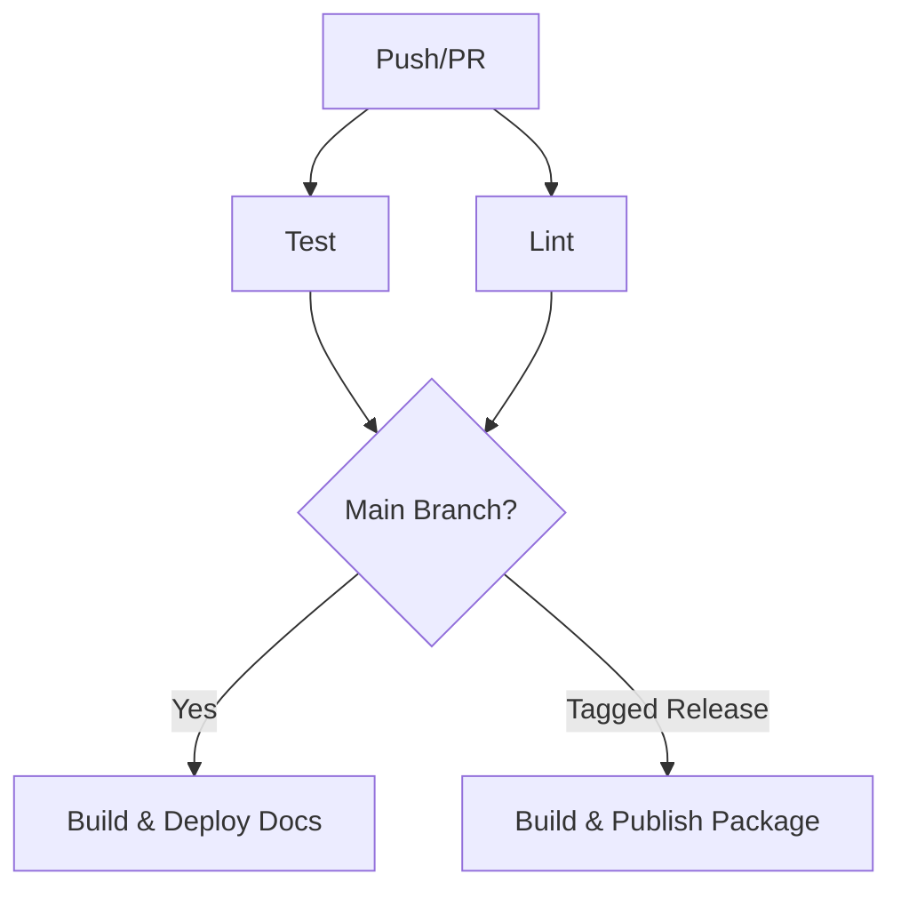

# 🌳 Git Workflow & Conventions

> A guide to our Git workflow and commit conventions

---

## 📝 Commit Message Structure

```bash
<type>(<scope>): <subject>
```

### 🏷️ Commit Types

| Type       | Icon | Description                |
| ---------- | ---- | -------------------------- |
| `feat`     | ✨   | New feature                |
| `fix`      | 🐛   | Bug fix                    |
| `docs`     | 📚   | Documentation changes      |
| `style`    | 💅   | Formatting changes         |
| `refactor` | ♻️   | Code restructuring         |
| `test`     | 🧪   | Test updates               |
| `chore`    | 🔧   | Build tasks, configs       |
| `ops`      | 🚀   | Infrastructure, deployment |

### ✍️ Writing Rules

- 🎯 **Scope**: *(Optional)* Component/module affected
- 📌 **Subject**: Use imperative mood ("Add" not "Added")

---

## 🌿 Branch Organization

### 📊 Core Branches

| Branch    | Icon | Purpose     | Key Rules                                                                   |
| --------- | ---- | ----------- | --------------------------------------------------------------------------- |
| `main`    | 🏭   | Production  | • No direct commits<br>• Only `release`/`hotfix` merges<br>• Version tagged |
| `develop` | 🔨   | Development | • Feature integration<br>• Next release prep                                |

### 🔄 Supporting Branches

| Type    | Pattern     | Flow                       | Purpose         |
| ------- | ----------- | -------------------------- | --------------- |
| Feature | `feature/*` | `develop` → `develop`      | ✨ New features |
| Release | `release/*` | `develop` → `main+develop` | 📦 Release prep |
| Hotfix  | `hotfix/*`  | `main` → `main+develop`    | 🚑 Quick fixes  |

---

## ⚡ Quick Commands

### 🌟 Feature Development

```bash
# 🏁 Start feature
git checkout -b feature/name develop

# ✅ Complete feature
git checkout develop
git merge --no-ff feature/name
git branch -d feature/name
git push origin develop
```

### 📦 Release Process

```bash
# 🏁 Start release
git checkout -b release/1.0.0 develop

# ✅ Complete release
git checkout main
git merge --no-ff release/1.0.0
git tag -a v1.0.0
git checkout develop
git merge --no-ff release/1.0.0
git branch -d release/1.0.0
git push --all && git push --tags
```

### 🚑 Hotfix Process

```bash
# 🏁 Start hotfix
git checkout -b hotfix/fix-name main

# ✅ Complete hotfix
git checkout main
git merge --no-ff hotfix/fix-name
git checkout develop
git merge --no-ff hotfix/fix-name
git branch -d hotfix/fix-name
git push --all
```

---

## 🚀 GitHub Actions CI/CD Workflow

> Automated testing, code quality checks, docs deployment, and releases

### 📊 CI/CD Pipeline Structure

### 📊 CI/CD Pipeline File



```yaml
[[include "../examples/yaml/ci-cd.yml"]]
```



Our workflow file `.github/workflows/ci-cd.yml` automates the following processes:

| Job       | Icon | Purpose                      | Trigger            |
| --------- | ---- | ---------------------------- | ------------------ |
| `test`    | 🧪   | Multi-platform testing       | All pushes and PRs |
| `lint`    | 🔍   | Code quality checks          | All pushes and PRs |
| `docs`    | 📚   | Documentation build & deploy | Pushes to main     |
| `release` | 📦   | Package build & PyPI publish | Tagged releases    |

### 🏗️ Workflow Overview



### 🧪 Testing Job



```yaml
test:
  runs-on: ${{ "{{ matrix.os }}" }}
  strategy:
    matrix:
      os: [ubuntu-latest, windows-latest]
      python-version: ['3.11', '3.12']
  steps:
    - uses: actions/checkout@v4
    - uses: actions/setup-python@v5
    - run: python -m pip install uv tox tox-gh-actions
    - run: tox
```



### 🔍 Linting Job



```yaml
lint:
  runs-on: ubuntu-latest
  steps:
    - uses: actions/checkout@v4
    - uses: actions/setup-python@v5
    - run: python -m pip install uv
    - run: uv pip install -e .[lint]
    - run: ruff check .
    - run: black --check .
    - run: mypy .
```



### 📚 Documentation Job



```yaml
docs:
  runs-on: ubuntu-latest
  needs: [test, lint]
  if: github.event_name == 'push' || github.event_name == 'workflow_dispatch'
  steps:
    - uses: actions/checkout@v4
      with:
        fetch-depth: 0
    - uses: actions/setup-python@v5
    - run: uv pip install -e .[docs] mike
    - run: git config --local user.email "github-actions[bot]@users.noreply.github.com"
    - run: git config --local user.name "github-actions[bot]"
    - run: mkdocs build -v
    - run: mike deploy --push --update-aliases $(git describe --tags --abbrev=0) latest
```



### 📦 Release Job



```yaml
release:
  runs-on: ubuntu-latest
  needs: [test, lint, docs]
  if: startsWith(github.ref, 'refs/tags/v')
  steps:
    - uses: actions/checkout@v4
    - uses: actions/setup-python@v5
    - run: python -m pip install build twine
    - run: python -m build
    - uses: softprops/action-gh-release@v1
      with:
        files: dist/*
        generate_release_notes: true
    - run: twine upload --skip-existing dist/*
      env:
        TWINE_USERNAME: ${{ "{{ secrets.PYPI_USERNAME }}" }}
        TWINE_PASSWORD: ${{ "{{ secrets.PYPI_PASSWORD }}" }}
```



### 🛠️ Configuration Tips

| Tip               | Icon | Description                                                   |
| ----------------- | ---- | ------------------------------------------------------------- |
| Secrets           | 🔒   | Add `PYPI_USERNAME` and `PYPI_PASSWORD` to repository secrets |
| Tox Integration   | 🔄   | Add [gh-actions] section to tox.ini                           |
| Branch Protection | 🛡️   | Require status checks to pass before merging                  |
| Manual Triggers   | 🔄   | Use workflow_dispatch for manual runs                         |
| Caching           | ⚡   | Dependencies cached for faster runs                           |

### 📋 Tox GitHub Actions Integration

Add this to your `tox.ini` file:

```ini
[gh-actions]
python =
    3.11: py311
    3.12: py312
```

### 🧩 Workflow Events

| Event               | Icon | Trigger                | Purpose                              |
| ------------------- | ---- | ---------------------- | ------------------------------------ |
| `push`              | 📤   | Pushing to main/master | Run tests and deploy docs            |
| `pull_request`      | 🔄   | PRs to main/master     | Run tests and linting                |
| `workflow_dispatch` | 🔘   | Manual UI trigger      | Run full pipeline on demand          |
| `tags`              | 🏷️   | Creating v\* tags      | Create releases and publish packages |

---

## 💡 Best Practices

| Practice           | Description                        |
| ------------------ | ---------------------------------- |
| 📝 Commit Messages | Write clear, descriptive messages  |
| 👀 Code Review     | Create PRs for all changes         |
| ✅ Testing         | Ensure all tests pass before merge |
| 📚 Documentation   | Keep docs updated with changes     |
| 🔄 CI/CD           | Use automated quality checks       |
| 🚀 Deployment      | Automate from `main` branch        |

---

## 📚 Resources

### 📖 Conventional Commits

| Resource                                                                                  | Icon | Purpose                  |
| ----------------------------------------------------------------------------------------- | ---- | ------------------------ |
| [Conventional Commits](https://www.conventionalcommits.org/)                              | 📜   | Official specification   |
| [Angular Guidelines](https://github.com/angular/angular/blob/main/CONTRIBUTING.md#commit) | 🅰️   | Reference implementation |
| [Commitlint](https://commitlint.js.org/)                                                  | ✨   | Commit message linting   |
| [Commitizen](https://commitizen.github.io/cz-cli/)                                        | 🛠️   | Interactive commit tool  |

### 🌊 Git Flow Resources

| Resource                                                                                        | Icon | Purpose                 |
| ----------------------------------------------------------------------------------------------- | ---- | ----------------------- |
| [Git Flow Original](https://nvie.com/posts/a-successful-git-branching-model/)                   | 📘   | Original workflow guide |
| [Atlassian Guide](https://www.atlassian.com/git/tutorials/comparing-workflows/gitflow-workflow) | 📗   | Comprehensive tutorial  |
| [GitHub Flow](https://docs.github.com/en/get-started/quickstart/github-flow)                    | 📓   | Simplified workflow     |
| [GitLab Flow](https://docs.gitlab.com/ee/topics/gitlab_flow.html)                               | 📔   | Enterprise approach     |

### ⚙️ GitHub Actions Resources

| Resource                                                                                           | Icon | Purpose                   |
| -------------------------------------------------------------------------------------------------- | ---- | ------------------------- |
| [GitHub Actions Docs](https://docs.github.com/en/actions)                                          | 📄   | Official documentation    |
| [Marketplace](https://github.com/marketplace?type=actions)                                         | 🛒   | Community actions         |
| [Workflow Syntax](https://docs.github.com/en/actions/reference/workflow-syntax-for-github-actions) | 📝   | YAML format reference     |
| [Python CI Examples](https://github.com/actions/setup-python)                                      | 🐍   | Python-specific workflows |

### 🛠️ Helpful Tools

| Tool                                                                                                                                      | Icon | Purpose                  |
| ----------------------------------------------------------------------------------------------------------------------------------------- | ---- | ------------------------ |
| [Husky](https://typicode.github.io/husky/)                                                                                                | 🐶   | Git hooks automation     |
| [Semantic Release](https://semantic-release.gitbook.io/)                                                                                  | 📦   | Version management       |
| [Conventional Changelog](https://github.com/conventional-changelog/conventional-changelog)                                                | 📝   | Auto-generate changelogs |
| [Git Flow AVH](https://github.com/petervanderdoes/gitflow-avh)                                                                            | 🔧   | Extended Git Flow CLI    |
| [Pre-commit Hooks Guide](https://gatlenculp.medium.com/effortless-code-quality-the-ultimate-pre-commit-hooks-guide-for-2025-57ca501d9835) | 🔍   | Code quality automation  |

### 🎨 Icon Resources

| Resource                                                               | Icon | Purpose                     |
| ---------------------------------------------------------------------- | ---- | --------------------------- |
| [Gitmoji](https://gitmoji.dev)                                         | 😄   | Emoji guide for Git commits |
| [GitHub Emoji](https://github.com/ikatyang/emoji-cheat-sheet)          | 📋   | Complete emoji cheatsheet   |
| [Emojipedia](https://emojipedia.org)                                   | 📚   | Emoji meanings and variants |
| [Unicode Emoji](https://unicode.org/emoji/charts/full-emoji-list.html) | 🌐   | Official Unicode emoji list |

---

> 💡 **Tip**: Bookmark this guide for quick reference during development
