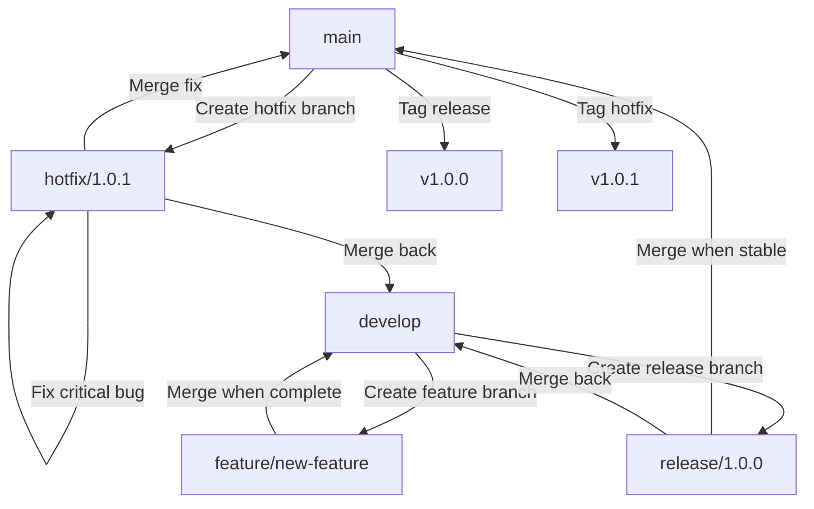

# 🌊 Git Flow Guide

> A comprehensive guide to the Git Flow branching model and workflow

---

## 📚 What is Git Flow?

Git Flow is a branching model for Git that provides a robust framework for managing larger projects. Designed by Vincent Driessen in 2010, it defines a strict branching structure built around project releases, providing a structured approach to version control that works well for teams and scheduled release cycles.

### 🎯 Key Benefits

| Benefit                 | Description                                       |
| ----------------------- | ------------------------------------------------- |
| 🏗️ Structure            | Clear, predefined branching structure             |
| 🔄 Parallel Development | Multiple features can be developed simultaneously |
| 🚀 Release Management   | Dedicated branches for release preparation        |
| 🚑 Emergency Fixes      | Hotfix mechanism for production issues            |
| 🧩 Team Collaboration   | Facilitates coordination among team members       |

---

## 🌿 Branch Structure

### 📊 Core Branches

Git Flow uses two main branches with infinite lifetime:

| Branch               | Icon | Purpose         | Description                                                                         |
| -------------------- | ---- | --------------- | ----------------------------------------------------------------------------------- |
| `main` (or `master`) | 🏭   | Production code | Contains production-ready code. Every commit represents a release version.          |
| `develop`            | 🔨   | Development     | Integration branch for features. Contains the latest delivered development changes. |

### 🔄 Supporting Branches

These branches have a limited lifetime and serve specific purposes:

| Branch Type | Pattern     | Source    | Target             | Purpose                      |
| ----------- | ----------- | --------- | ------------------ | ---------------------------- |
| Feature     | `feature/*` | `develop` | `develop`          | ✨ New features development  |
| Release     | `release/*` | `develop` | `main` & `develop` | 📦 Release preparation       |
| Hotfix      | `hotfix/*`  | `main`    | `main` & `develop` | 🚑 Critical production fixes |

---

## 🔄 Git Flow Workflow Diagram



---

## ⚡ Workflow Processes

### 🌟 Feature Development

Feature branches are used for developing new features for upcoming releases.

```bash
# 🏁 Start a new feature
git flow feature start new-feature
# Or with standard Git commands:
git checkout -b feature/new-feature develop

# 💻 Work on the feature, commit changes
git add .
git commit -m "feat: add new feature functionality"

# ✅ Complete the feature
git flow feature finish new-feature
# Or with standard Git commands:
git checkout develop
git merge --no-ff feature/new-feature
git branch -d feature/new-feature
git push origin develop
```

### 📦 Release Process

Release branches support preparation of a new production release and allow for minor bug fixes and metadata preparation.

```bash
# 🏁 Start a release
git flow release start 1.0.0
# Or with standard Git commands:
git checkout -b release/1.0.0 develop

# 🔧 Make release adjustments, version bumps, etc.
git add .
git commit -m "chore: bump version to 1.0.0"

# ✅ Complete the release
git flow release finish 1.0.0
# Or with standard Git commands:
git checkout main
git merge --no-ff release/1.0.0
git tag -a v1.0.0 -m "Version 1.0.0"
git checkout develop
git merge --no-ff release/1.0.0
git branch -d release/1.0.0
git push --all && git push --tags
```

### 🚑 Hotfix Process

Hotfix branches are used to quickly patch production releases.

```bash
# 🏁 Start a hotfix
git flow hotfix start 1.0.1
# Or with standard Git commands:
git checkout -b hotfix/1.0.1 main

# 🔧 Fix the critical bug
git add .
git commit -m "fix: critical production issue"

# ✅ Complete the hotfix
git flow hotfix finish 1.0.1
# Or with standard Git commands:
git checkout main
git merge --no-ff hotfix/1.0.1
git tag -a v1.0.1 -m "Version 1.0.1"
git checkout develop
git merge --no-ff hotfix/1.0.1
git branch -d hotfix/1.0.1
git push --all && git push --tags
```

---

## 🛠️ Git Flow Tools

### 🧰 Git Flow Extension

The `git-flow` extension provides high-level repository operations for Vincent Driessen's branching model.

```bash
# Installation
# On macOS
brew install git-flow

# On Windows (with Chocolatey)
choco install git-flow-winsetup

# On Linux
sudo apt-get install git-flow  # Debian/Ubuntu
sudo yum install gitflow       # CentOS/RHEL
```

### 🚀 Initializing Git Flow

```bash
# Initialize Git Flow in a repository
git flow init

# You'll be prompted to configure branch naming conventions
# Accept the defaults or customize as needed
```

---

## 💡 Best Practices

| Practice                    | Description                                                 |
| --------------------------- | ----------------------------------------------------------- |
| 🔒**Protect Main Branches** | Set up branch protection for `main` and `develop`           |
| 🔍**Code Reviews**          | Require pull requests and code reviews before merging       |
| 🧪**Testing**               | Run tests before completing features, releases, or hotfixes |
| 📝**Clear Commit Messages** | Follow conventional commit format                           |
| 🏷️**Semantic Versioning**   | Use semantic versioning for releases (MAJOR.MINOR.PATCH)    |
| 📚**Documentation**         | Update documentation with each release                      |
| 🔄**Regular Integration**   | Frequently merge `develop` into feature branches            |

---

## ❓ When to Use Git Flow

### ✅ Ideal For

- Teams with scheduled release cycles
- Projects with multiple versions in production
- Software that requires formal QA processes
- Projects with CI/CD pipelines

### ⚠️ May Be Overkill For

- Small projects or teams
- Continuous delivery environments
- Projects with rapid release cycles
- Solo developers

---

## 🔄 Git Flow vs. Other Workflows

| Workflow          | Best For                     | Key Difference                                  |
| ----------------- | ---------------------------- | ----------------------------------------------- |
| 🌊**Git Flow**    | Scheduled releases           | Structured with multiple branch types           |
| 🔄**GitHub Flow** | Continuous deployment        | Simplified with focus on feature branches       |
| 🦊**GitLab Flow** | Environment-based deployment | Adds environment branches                       |
| 🌿**Trunk-Based** | Continuous integration       | Short-lived branches merged to trunk frequently |

---

## 📚 Resources

| Resource                                                                                                    | Description                                              |
| ----------------------------------------------------------------------------------------------------------- | -------------------------------------------------------- |
| [Original Git Flow Post](https://nvie.com/posts/a-successful-git-branching-model/)                          | Vincent Driessen's original article introducing Git Flow |
| [Atlassian Git Flow Tutorial](https://www.atlassian.com/git/tutorials/comparing-workflows/gitflow-workflow) | Comprehensive explanation with examples                  |
| [Git Flow Cheatsheet](https://danielkummer.github.io/git-flow-cheatsheet/)                                  | Quick reference for Git Flow commands                    |
| [Git Flow AVH Edition](https://github.com/petervanderdoes/gitflow-avh)                                      | Enhanced version of the Git Flow extensions              |
| [Edraw Git Flow Diagram](https://www.edrawmax.com/article/gitflow-diagram.html)                             | Visual explanation of the Git Flow model                 |
| [Dev.to Git Flow Introduction](https://dev.to/fernando_ayon/git-flow-an-introduction-430m)                  | Practical introduction to Git Flow                       |
| [Git Flow Documentation](https://git-flow.readthedocs.io/en/latest/index.html)                              | Official documentation for Git Flow                      |
| [Atlassian Git Tutorials](https://www.atlassian.com/git/tutorials)                                          | Comprehensive Git tutorials including Git Flow           |

---

> 💡 **Tip**: Consider your project's specific needs when deciding whether to adopt Git Flow. While it provides excellent structure for certain projects, simpler workflows might be more appropriate for others.
