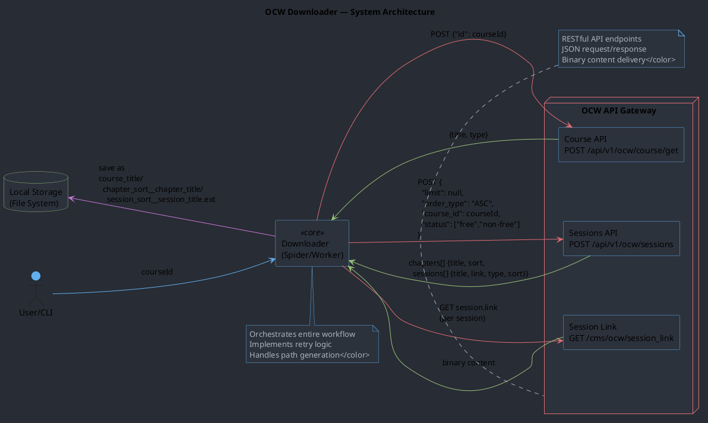
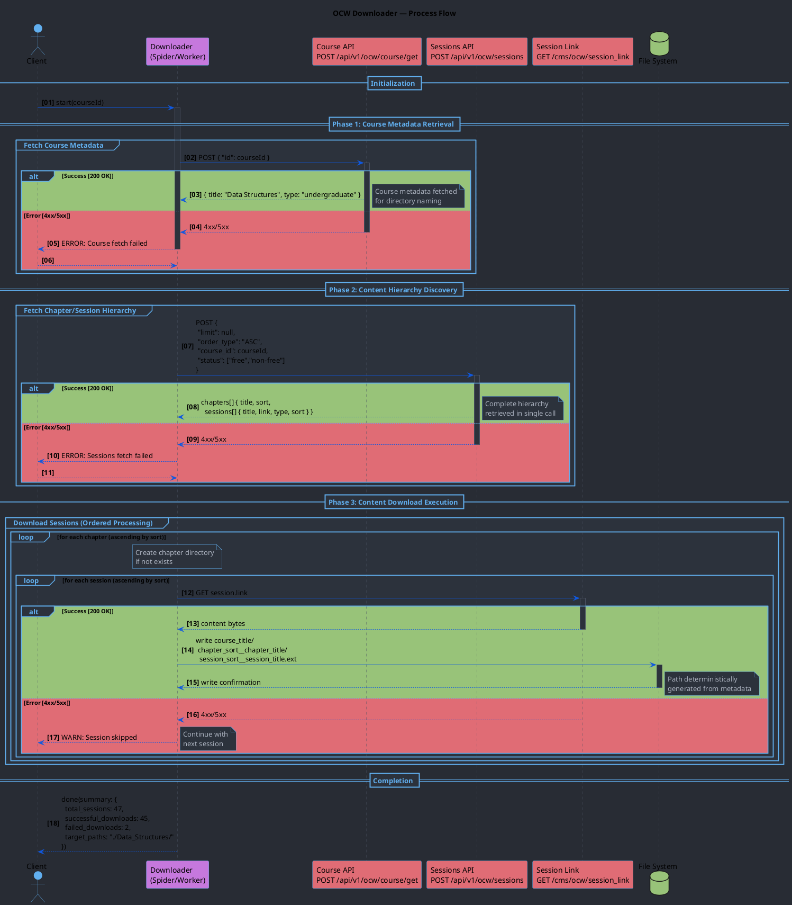
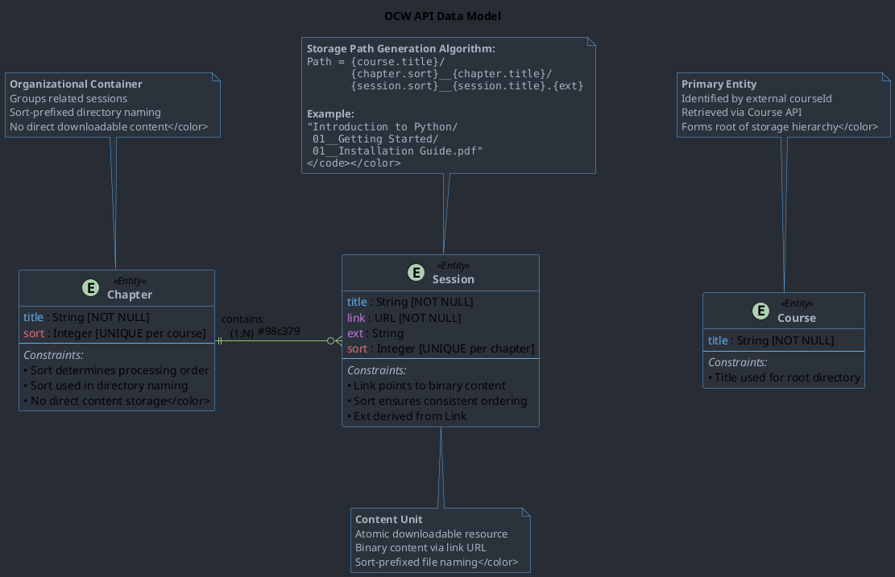

# OCW Downloader System Analysis Document

## Executive Summary

The OCW Downloader System is a content acquisition and organization solution designed to systematically download and persist OpenCourseWare materials. The system interfaces with multiple OCW APIs to retrieve course metadata, hierarchical content structure, and binary session files, organizing them into a deterministic filesystem structure. This architecture enables reliable, repeatable downloads with human-readable directory organization following the pattern: `course_title/chapter_sort__chapter_title/session_sort__session_title.ext`.

## System Overview

### Core Components

The system architecture comprises five primary components working in orchestrated harmony:

1. #### User/CLI Interface

- Entry point for system interaction
- Accepts courseId as primary input parameter
- Receives status updates and completion summaries

1. #### Downloader (Spider/Worker)

- Central orchestration engine
- Manages API communication sequencing
- Handles error recovery and retry logic
- Implements deterministic path generation algorithm

1. #### OCW API Suite

- **Course API**: Provides course-level metadata (title, type)
- **Sessions API**: Returns hierarchical content structure with sort ordering
- **Sessions Link**: Binary content delivery endpoint

1. #### Local Storage (File System)

- Persistent storage layer
- Maintains hierarchical directory structure
- Preserves content with deterministic naming convention

### Component Interaction Diagram

## Interaction Analysis

The system demonstrates a well-structured service-oriented architecture with clear separation of concerns:

### Key Interaction Patterns

1. **Sequential Dependency Chain**: Course metadata must be retrieved before session listing, establishing a critical path for data acquisition
2. **Hierarchical Data Resolution**: The Sessions API provides complete navigational structure in a single response, minimizing API calls
3. **Parallel Download Capability**: Individual session downloads are independent, enabling potential parallelization
4. **Deterministic Path Generation**: Sort keys ensure consistent, reproducible filesystem organization across multiple executions

### Communication Protocols

- **Metadata APIs**: JSON-based POST requests with structured payloads
- **Binary Endpoint**: Simple GET requests with URL-based session identification
- **Error Handling**: Non-blocking session failures with graceful degradation

## Process Flow Analysis

### Sequence Diagram

### Process Flow Characteristics

1. **Three-Phase Execution Model**:

    - **Phase 1**: Course metadata acquisition (blocking)
    - **Phase 2**: Session hierarchy retrieval (blocking)
    - **Phase 3**: Content download (non-blocking per session)

2. **Error Recovery Strategy**:

    - Critical failures (Phases 1-2): Terminate execution
    - Non-critical failures (Phase 3): Log and continue

## Data Model Analysis

### API Data Model Diagram

### Data Model Insights

#### Schema Characteristics

1. ##### Course Schema

    - Key attributes: title (directory naming)

2. ##### Chapter Schema

    - Organizational unit without direct content
    - Sort attribute ensures deterministic ordering
    - Relationship: Children (Sessions)

3. ##### Session Schema

    - Atomic content unit with downloadable resource
    - Link attribute provides content access URL
    - Sort attribute maintains consistent ordering within chapter

#### Data Integrity Considerations

- Sort values must be unique within their scope (course/chapter)
- Path generation algorithm ensures filesystem compatibility
