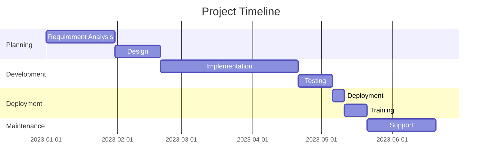
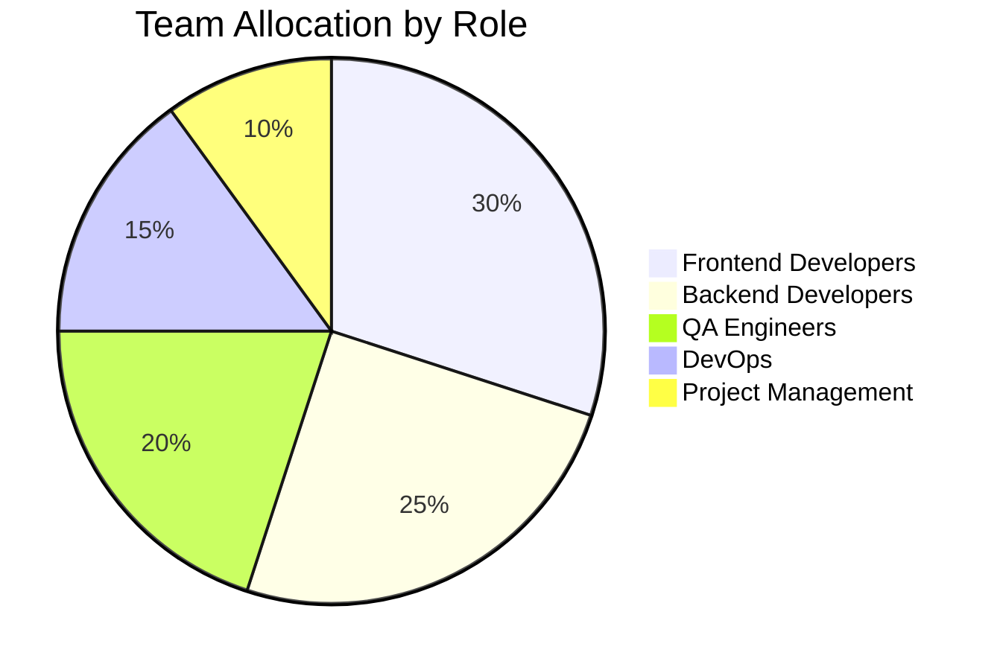
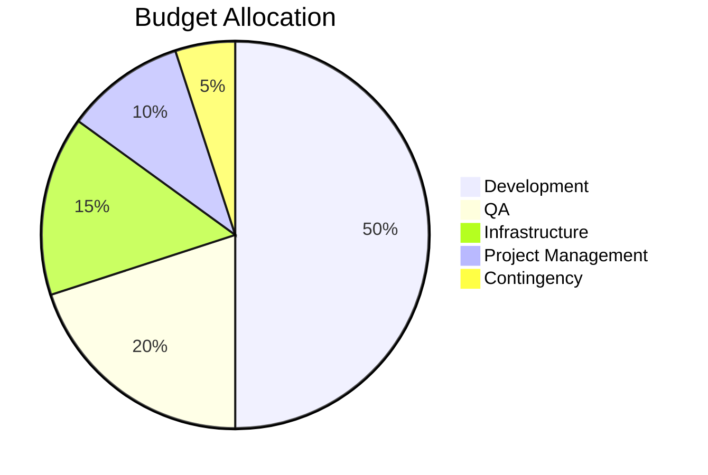

## :material-chart-timeline-variant: Project Past Performance Report

## :material-information: Project Metadata

| Attribute              | Value                                                                                                                                           |
| ---------------------- | ----------------------------------------------------------------------------------------------------------------------------------------------- |
| **Project Name**       | [Project Name]                                                                                                                                  |
| **Project ID**         | [Project ID]                                                                                                                                    |
| **Duration**           | [Start Date] to [End Date]                                                                                                                      |
| **Client/Stakeholder** | [Client/Stakeholder Name]                                                                                                                       |
| **Team Size**          | [Number] team members                                                                                                                           |
| **Budget**             | [Budget Amount]                                                                                                                                 |
| **Final Cost**         | [Final Cost]                                                                                                                                    |
| **Repository**         | [Link to Repository]                                                                                                                            |
| **Documentation**      | [Link to Documentation]                                                                                                                         |
| **Status**             | :material-check-circle:{ .success } Completed / :material-progress-clock:{ .warning } In Progress / :material-alert-circle:{ .error } Cancelled |

## :material-text-box: Project Context

!!! info "Project Overview"

    [Provide a concise overview of the project, including its purpose, scope, and business context. Explain why the project was initiated and what business needs it addressed.]

### :material-account-group: Stakeholders

| Stakeholder       | Role   | Involvement                  |
| ----------------- | ------ | ---------------------------- |
| [Name/Department] | [Role] | [Description of involvement] |
| [Name/Department] | [Role] | [Description of involvement] |

### :material-tools: Technology Stack

- **Frontend**: [Technologies used]
- **Backend**: [Technologies used]
- **Database**: [Technologies used]
- **Infrastructure**: [Technologies used]
- **Testing Tools**: [Technologies used]
- **CI/CD**: [Technologies used]

## :material-target: Objectives, OKRs & KPIs

### :material-flag-checkered: Project Objectives

1. [Objective 1]
2. [Objective 2]
3. [Objective 3]

### :material-chart-areaspline: OKRs (Objectives and Key Results)

=== "Objective 1"

    - **Key Result 1**: [Description] - :material-check:{ .success } Achieved / :material-close:{ .error } Not Achieved
    - **Key Result 2**: [Description] - :material-check:{ .success } Achieved / :material-close:{ .error } Not Achieved
    - **Key Result 3**: [Description] - :material-check:{ .success } Achieved / :material-close:{ .error } Not Achieved

=== "Objective 2"

    - **Key Result 1**: [Description] - :material-check:{ .success } Achieved / :material-close:{ .error } Not Achieved
    - **Key Result 2**: [Description] - :material-check:{ .success } Achieved / :material-close:{ .error } Not Achieved
    - **Key Result 3**: [Description] - :material-check:{ .success } Achieved / :material-close:{ .error } Not Achieved

### :material-chart-bar: KPIs (Key Performance Indicators)

| KPI     | Target   | Actual   | Status                                                            |
| ------- | -------- | -------- | ----------------------------------------------------------------- |
| [KPI 1] | [Target] | [Actual] | :material-arrow-up:{ .success } / :material-arrow-down:{ .error } |
| [KPI 2] | [Target] | [Actual] | :material-arrow-up:{ .success } / :material-arrow-down:{ .error } |
| [KPI 3] | [Target] | [Actual] | :material-arrow-up:{ .success } / :material-arrow-down:{ .error } |

## :material-timeline-alert: Key Challenges

### :material-alert: Technical Challenges

!!! danger "Challenge 1"

    **Description**: [Describe the technical challenge]

    **Impact**: [Explain the impact on the project]

    **Resolution**: [Describe how the challenge was addressed]

!!! danger "Challenge 2"

    **Description**: [Describe the technical challenge]

    **Impact**: [Explain the impact on the project]

    **Resolution**: [Describe how the challenge was addressed]

### :material-account-alert: Business Challenges

!!! warning "Challenge 1"

    **Description**: [Describe the business challenge]

    **Impact**: [Explain the impact on the project]

    **Resolution**: [Describe how the challenge was addressed]

!!! warning "Challenge 2"

    **Description**: [Describe the business challenge]

    **Impact**: [Explain the impact on the project]

    **Resolution**: [Describe how the challenge was addressed]

## :material-lightbulb-on: Lessons Learned

### :material-code-tags: Technical Lessons

??? success "Lesson 1"

    **Observation**: [Describe what was observed]

    **Lesson**: [Describe what was learned]

    **Future Application**: [Describe how this lesson can be applied in future projects]

??? success "Lesson 2"

    **Observation**: [Describe what was observed]

    **Lesson**: [Describe what was learned]

    **Future Application**: [Describe how this lesson can be applied in future projects]

### :material-briefcase: Business Lessons

??? tip "Lesson 1"

    **Observation**: [Describe what was observed]

    **Lesson**: [Describe what was learned]

    **Future Application**: [Describe how this lesson can be applied in future projects]

??? tip "Lesson 2"

    **Observation**: [Describe what was observed]

    **Lesson**: [Describe what was learned]

    **Future Application**: [Describe how this lesson can be applied in future projects]

## :material-chart-timeline: Project Timeline

## :material-chart-donut: Resource Utilization

### :material-account-clock: Team Allocation

### :material-currency-usd: Budget Breakdown

## :material-thumb-up: Success Factors

- [Success Factor 1]
- [Success Factor 2]
- [Success Factor 3]

## :material-thumb-down: Areas for Improvement

- [Area for Improvement 1]
- [Area for Improvement 2]
- [Area for Improvement 3]

## :material-file-document: Supporting Documents

- [Link to Project Charter]
- [Link to Requirements Document]
- [Link to Technical Documentation]
- [Link to Test Reports]
- [Link to User Feedback]

## :material-comment-quote: Stakeholder Feedback

> "[Stakeholder quote about the project]"
>
> — [Stakeholder Name], [Stakeholder Role]

> "[Stakeholder quote about the project]"
>
> — [Stakeholder Name], [Stakeholder Role]

## :material-check-all: Conclusion

[Provide a concise summary of the project's performance, highlighting major achievements, challenges, and key takeaways. Include recommendations for similar future projects.]
