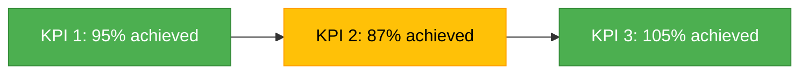
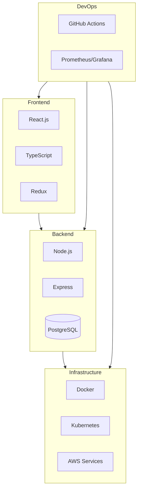
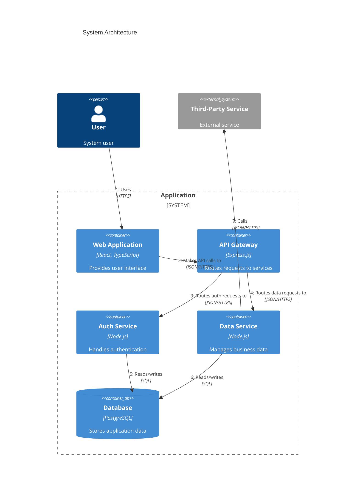
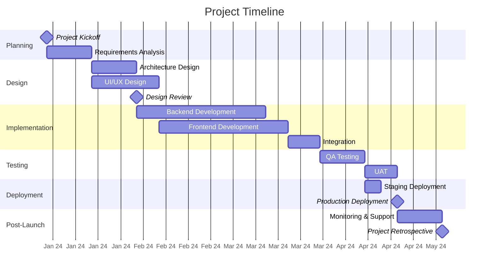

## Software Project Past Performance Templat

## :material-information: Executive Summary

> A concise, high-level overview of the project highlighting purpose, key outcomes, and business impact.

## :material-calendar-clock: Project Overview

=== "Basic Information"

    | Attribute                   | Details                         |
    | :-------------------------- | :------------------------------ |
    | **Project Duration**        | X months (Jan 2024 - Jun 2024)  |
    | **Team Size**               | X developers, Y designers, Z QA |
    | **Development Methodology** | Agile/Scrum/Kanban/Waterfall    |
    | **Primary Stakeholders**    | Department A, Business Unit B   |

=== "Business Context"

    Detailed explanation of the business need or problem that initiated the project. Include market conditions, competitive pressures, or regulatory requirements that influenced the project's inception.

=== "Project Scope"

    Clear definition of what was included in and excluded from the project scope. Include key deliverables and acceptance criteria.

## :octicons-goal-16: Objectives & Results

### :material-target: Original Objectives

!!! info "Business Objectives"

    - Objective 1
    - Objective 2
    - Objective 3

!!! abstract "Technical Objectives"

    - Objective 1
    - Objective 2
    - Objective 3

### :material-chart-timeline-variant: OKRs Tracking

| Objective                | Key Result                | Target        | Actual       | Status                              |
| :----------------------- | :------------------------ | :------------ | :----------- | :---------------------------------- |
| Increase user engagement | Improve session duration  | 25% increase  | 30% increase | :material-check-circle:{ .success } |
| Reduce system latency    | Average API response time | \<100ms       | 85ms         | :material-check-circle:{ .success } |
| Enhance data security    | Implement MFA             | 100% coverage | 90% coverage | :material-alert-circle:{ .warning } |

### :material-chart-box: Key Performance Indicators

## :material-code-tags: Technical Implementation

### :material-stack-overflow: Technology Stack

### :material-source-branch: Architecture Overview

Brief explanation of system architecture with key components, interfaces, and data flows.

### :material-code-array: Code Quality Metrics

| Metric            | Target            | Actual   | Status                              |
| :---------------- | :---------------- | :------- | :---------------------------------- |
| Test Coverage     | >80%              | 85%      | :material-check-circle:{ .success } |
| Code Complexity   | \<15              | 12       | :material-check-circle:{ .success } |
| Static Analysis   | 0 critical issues | 0 issues | :material-check-circle:{ .success } |
| Performance Score | >90               | 92       | :material-check-circle:{ .success } |

## :material-bookmark-multiple: Key Challenges & Solutions

!!! danger "Challenge 1: [Challenge Name]"

    **Context**: Description of the challenge, its impact, and why it was significant.

    **Approach**: Steps taken to address the challenge.

    **Solution**: Final implementation and how it resolved the issue.

    **Impact**: Quantifiable results and business outcomes.

!!! danger "Challenge 2: [Challenge Name]"

    **Context**: Description of the challenge, its impact, and why it was significant.

    **Approach**: Steps taken to address the challenge.

    **Solution**: Final implementation and how it resolved the issue.

    **Impact**: Quantifiable results and business outcomes.

## :material-school: Lessons Learned

=== "Technical Lessons"

    !!! success "Lesson 1: [Lesson Title]"

        Detailed explanation of the technical lesson learned, including context, discovery process, and how this knowledge improved the project or can be applied to future projects.

    !!! success "Lesson 2: [Lesson Title]"

        Detailed explanation of another technical lesson.

=== "Business Lessons"

    !!! tip "Lesson 1: [Lesson Title]"

        Detailed explanation of the business lesson learned, including context, stakeholder interactions, and how this insight improved business outcomes or relationships.

    !!! tip "Lesson 2: [Lesson Title]"

        Detailed explanation of another business lesson.

=== "Process Improvements"

    !!! note "Process 1: [Process Title]"

        Explanation of how a specific process was improved during the project, including the before state, changes made, and resulting improvements.

    !!! note "Process 2: [Process Title]"

        Explanation of another process improvement.

## :material-timeline: Project Timeline

## :material-finance: Budget & Resources

| Category           | Planned       | Actual        | Variance | Notes                 |
| :----------------- | :------------ | :------------ | :------- | :-------------------- |
| Development        | \$XXX,XXX     | \$XXX,XXX     | X%       | Details on variance   |
| Infrastructure     | \$XX,XXX      | \$XX,XXX      | X%       | Details on variance   |
| QA & Testing       | \$XX,XXX      | \$XX,XXX      | X%       | Details on variance   |
| Project Management | \$XX,XXX      | \$XX,XXX      | X%       | Details on variance   |
| **Total**          | **\$XXX,XXX** | **\$XXX,XXX** | **X%**   | Overall budget status |

## :material-account-group: Team Performance

!!! abstract "Team Composition"

    Details about team structure, roles, and responsibilities.

!!! example "Velocity Metrics"

    Analysis of team velocity throughout the project, including sprint performance and delivery cadence.

!!! tip "Collaboration Highlights"

    Notable examples of effective teamwork and cross-functional collaboration.

## :material-tag-text: Attachments & References

- [Project Charter](link-to-document)
- [Technical Specifications](link-to-document)
- [User Acceptance Criteria](link-to-document)
- [Final Project Report](link-to-document)

## :material-camera-plus: Screenshots & Demos

=== "UI Screenshots"

     *Caption describing the screenshot*

=== "Architecture Diagrams"

     *Caption describing the architecture*

=== "Demo Videos"

    <video controls>
      <source src="path/to/demo.mp4" type="video/mp4">
      Your browser does not support the video tag.
    </video>
    *Caption describing the demo*
