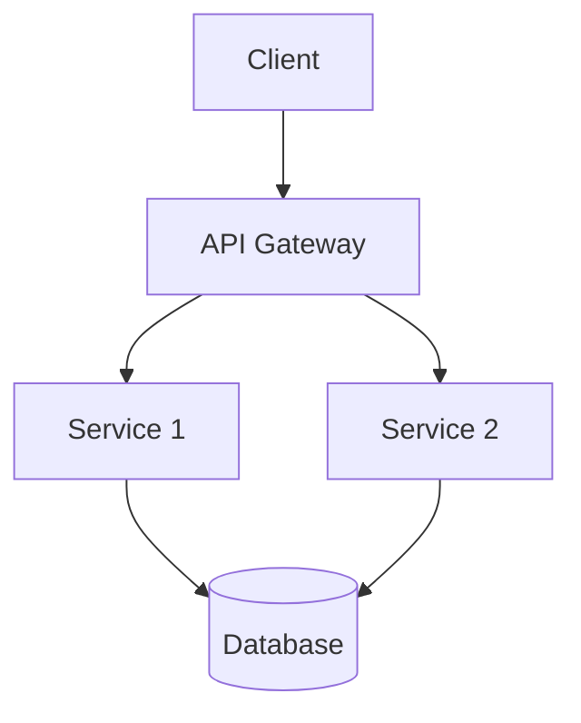

## Project Past Performance Report Template

## :rocket: [Project Name]

**Duration**: [Start Date] - [End Date] **Client/Department**: [Client or Department Name] **Team Size**: [Number] engineers

## :dart: Project Overview

> A concise summary of the project's purpose, scope, and significance.

[Provide a 2-3 paragraph overview of the project that clearly articulates the business context and technical objectives]

---

## :clipboard: Project Details

### :dart: Objectives

| Objective     | Description   | Status                            |
| ------------- | ------------- | --------------------------------- |
| [Objective 1] | [Description] | :material-check-circle:{.success} |
| [Objective 2] | [Description] | :material-close-circle:{.error}   |
| [Objective 3] | [Description] | :material-alert-circle:{.warning} |

### :chart_with_upwards_trend: Key Performance Indicators

!!! success "KPI Achievement"

    | KPI     | Target   | Actual   | Status                          |
    | ------- | -------- | -------- | ------------------------------- |
    | [KPI 1] | [Target] | [Actual] | :material-arrow-up:{ .success } |
    | [KPI 2] | [Target] | [Actual] | :material-arrow-down:{ .error } |
    | [KPI 3] | [Target] | [Actual] | :material-minus:{ .warning }    |

### :bulb: OKRs Alignment

=== "Objective 1"

    - Key Result 1: [Description and outcome]
    - Key Result 2: [Description and outcome]
    - Key Result 3: [Description and outcome]

=== "Objective 2"

    - Key Result 1: [Description and outcome]
    - Key Result 2: [Description and outcome]
    - Key Result 3: [Description and outcome]

---

## :gear: Technical Implementation

### :wrench: Technology Stack

- **Frontend**: [Technologies used]
- **Backend**: [Technologies used]
- **Database**: [Technologies used]
- **DevOps**: [Technologies used]
- **Testing**: [Technologies used]

### :jigsaw: Architecture Overview

[Brief description of the system architecture with optional diagram]

---

## :mountain_snow: Key Challenges

!!! warning "Challenge 1: [Title]"

    [Description of the challenge, its impact, and how it was addressed]

!!! warning "Challenge 2: [Title]"

    [Description of the challenge, its impact, and how it was addressed]

!!! warning "Challenge 3: [Title]"

    [Description of the challenge, its impact, and how it was addressed]

---

## :mortar_board: Lessons Learned

### :computer: Technical Learnings

1. **[Learning Title]**: [Detailed explanation of the technical learning]
2. **[Learning Title]**: [Detailed explanation of the technical learning]
3. **[Learning Title]**: [Detailed explanation of the technical learning]

### :briefcase: Business Learnings

1. **[Learning Title]**: [Detailed explanation of the business learning]
2. **[Learning Title]**: [Detailed explanation of the business learning]
3. **[Learning Title]**: [Detailed explanation of the business learning]

---

## :camera: Visual Documentation

### Screenshots

- 

    *Caption: [Brief description]*

- 

    *Caption: [Brief description]*

- 

    *Caption: [Brief description]*

### Demo Video

  <iframe src="[URL to video]" title="Project Demo" frameborder="0" allow="accelerometer; autoplay; clipboard-write; encrypted-media; gyroscope; picture-in-picture" allowfullscreen></iframe>

---

## :people_holding_hands: Team & Contributors

| Name   | Role   | Contribution Area         |
| ------ | ------ | ------------------------- |
| [Name] | [Role] | [Main contribution areas] |
| [Name] | [Role] | [Main contribution areas] |
| [Name] | [Role] | [Main contribution areas] |

---

## :bookmark_tabs: Additional Resources

- [Link to project repository]
- [Link to documentation]
- [Link to related resources]
- [Link to post-mortem]

---

*Last updated: [Date]*
