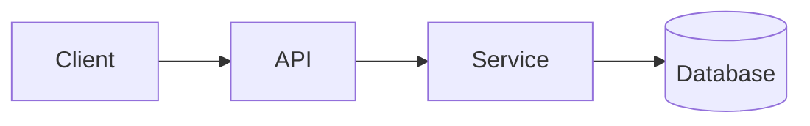

## Minimal Project Performance Report

## :rocket: Project Name

**Duration**: MMM YYYY - MMM YYYY **Client**: Client Name **Team**: X developers

## Overview

> Brief project description and business context

## :dart: Objectives & Results

| Objective       | Status                              |
| --------------- | ----------------------------------- |
| Key objective 1 | :material-check-circle:{ .success } |
| Key objective 2 | :material-alert-circle:{ .warning } |

### :chart_with_upwards_trend: KPIs

| Metric | Target | Actual | Status                          |
| ------ | ------ | ------ | ------------------------------- |
| KPI 1  | Target | Actual | :material-arrow-up:{ .success } |
| KPI 2  | Target | Actual | :material-arrow-down:{ .error } |

### OKRs

- **Objective 1**
    - KR1: Outcome
    - KR2: Outcome
- **Objective 2**
    - KR1: Outcome
    - KR2: Outcome

## :gear: Implementation

**Stack**: Frontend (Tech), Backend (Tech), Database (Tech)

## ⛰ Challenges & Solutions

!!! warning "Challenge: Title"

    Problem description and solution implemented

## 💡 Key Learnings

### Technical

- **Learning 1**: Brief description of technical insight
- **Learning 2**: Brief description of technical insight

### Business

- **Learning 1**: Brief description of business insight
- **Learning 2**: Brief description of business insight

## 📷 Visual Documentation

- 
- 

### Demo

  <iframe src="[video-url]" title="Demo" frameborder="0" allowfullscreen></iframe>

## 🔗 Resources

- [Repository](url)
- [Documentation](url)

## 📝 \*\*Last updated: YYYY-MM-DD
