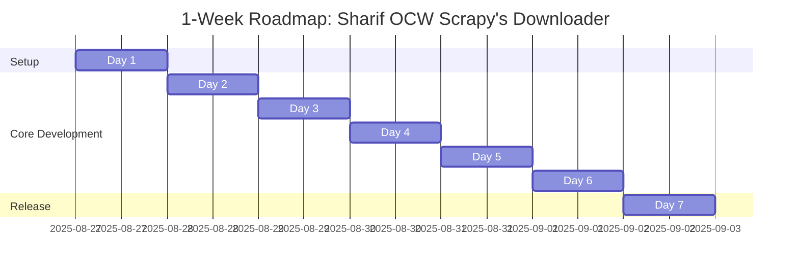

# 🗺 Project Roadmap: Sharif OCW Scrapy's Downloader

## Sprint Overview (Day 0)

**Project Goal:** Deliver an MVP Scrapy-based downloader for Sharif OCW that:

- Fetches course metadata and sessions
- Downloads all downloadable files
- Organizes outputs into structured folders
- Provides progress tracking and basic error handling

**Success Criteria:**

- Able to download at least one complete course (videos + PDFs)
- Correct directory structure with sanitized filenames
- Basic duplicate detection + retry handling works
- GitHub issues, milestones, and PRs follow roadmap

**Team Size:** 1 developer (solo)

**Roles & Responsibilities:**

- Developer: Implement, test, document, manage repo, and review

**Definition of Done (DoD):**

- Code compiles and runs without errors
- Passes basic integration tests on one sample course
- Artifacts stored in correct directory structure
- Pull requests merged into `main` with review checklist passed

---

## 📆 Daily Breakdown (1-Week Sprint)

### **Day 1 – Setup & Foundations**

- **Primary Focus:** Repo setup, environment, baseline structure
- **Deliverables:** GitHub repo initialized, Scrapy project skeleton, `.env` config
- **Tasks:**

  - [X] Create GitHub repo and add README (1h)
  - [X] Setup Python env + Scrapy project (2h)
  - [X] Implement `OCWSettings` using Pydantic (3h)
  - [X] Setup GitHub Actions CI with lint/test (2h)
- **Dependencies:** None
- **Review Points:** Repo initialized with CI passing

---

### **Day 2 – Data Models & Items**

- **Primary Focus:** Define structured data models
- **Deliverables:** Pydantic models (`Course`, `Chapter`, `Session`), Scrapy Items
- **Tasks:**

  - [ ] Implement Pydantic models with validation (3h)
  - [X] Implement Scrapy Items (2h)
  - [ ] Unit tests for model validation (3h)
- **Dependencies:** Day 1 settings module
- **Review Points:** Models validate sample OCW API responses

---

### **Day 3 – Core Spider Implementation**

- **Primary Focus:** Implement OCW Spider
- **Deliverables:** Working spider fetching metadata + sessions
- **Tasks:**

  - [X] Implement `CourseSpider` (4h)
  - [X] Handle request/response parsing (2h)
  - [ ] Basic error handling/logging (2h)
- **Dependencies:** Data models from Day 2
- **Review Points:** Spider outputs structured items for one course

---

### **Day 4 – Pipelines (Validation & Storage)**

- **Primary Focus:** Validate, deduplicate, and structure files
- **Deliverables:** ValidationPipeline, DuplicatesPipeline, FileSystemPipeline
- **Tasks:**

  - [ ] Implement ValidationPipeline (2h)
  - [ ] Implement DuplicatesPipeline (3h)
  - [ ] Implement FileSystemPipeline (3h)
- **Dependencies:** Spider outputs (Day 3)
- **Review Points:** Files stored in correct structure with validation

---

### **Day 5 – Download & Progress Tracking**

- **Primary Focus:** File downloads + progress monitoring
- **Deliverables:** DownloadPipeline, ProgressPipeline, Extensions
- **Tasks:**

  - [ ] Implement DownloadPipeline extending FilesPipeline (3h)
  - [ ] Implement ProgressPipeline + Extension (3h)
  - [ ] Test downloads with sample courses (2h)
- **Dependencies:** Pipelines from Day 4
- **Review Points:** Files download correctly with progress logs

---

### **Day 6 – Middleware & Error Handling**

- **Primary Focus:** Robust request/response handling
- **Deliverables:** HeadersMiddleware, RetryMiddleware, ErrorHandler
- **Tasks:**

  - [ ] Implement HeadersMiddleware for API (2h)
  - [ ] Implement RetryMiddleware with backoff (3h)
  - [ ] Implement ErrorHandlerMiddleware + ResponseValidator (3h)
- **Dependencies:** Spider from Day 3
- **Review Points:** Handles retries, logs errors gracefully

---

### **Day 7 – Testing, Docs & Release**

- **Primary Focus:** Final polish, testing, documentation
- **Deliverables:** CLI runner, docs, GitHub milestone closure
- **Tasks:**

  - [ ] Implement CLI `runner.py` (2h)
  - [ ] Integration tests on sample course (2h)
  - [ ] Write docs: setup + usage (2h)
  - [ ] Sprint review & GitHub release (2h)
- **Dependencies:** All previous work
- **Review Points:** MVP ready, can fetch and download a full course

---

## 🔗 +GitHub Integration

- **Milestones:**

  - `v0.1-MVP` → Completed after Sprint (Day 7)
- **Issue Templates:**

  - `bug_report.md`
  - `feature_request.md`
- **Labels:**

  - `must-have`, `should-have`, `could-have`, `won't-have`
  - `bug`, `enhancement`, `documentation`
- **Branch Strategy:**

  - `main` → stable
  - `dev` → active development
  - `feature/*` → per feature
- **PR Workflow:**

  - Open PR → CI checks → Self-review → Merge to `dev` → Periodic merge to `main`

---

## ⚠ Risk Mitigation

1. **Risk:** API endpoint changes

   - **Plan:** Abstract URLs/settings in config, version pinning
2. **Risk:** Large file downloads (timeouts)

   - **Plan:** Retry middleware + configurable timeout
3. **Risk:** File name collisions / OS issues

   - **Plan:** Path sanitization utility + max length enforcement

---

## 📊 MoSCoW Prioritization

- **Must Have:** Basic spider, pipelines, file downloads, progress
- **Should Have:** Retry logic, duplicates detection, CLI runner
- **Could Have:** Advanced stats, pretty dashboards, parallel course downloads
- **Won’t Have:** GUI interface (out of scope for MVP)

---

## 📌 Mermaid Sprint Timeline

## Branch-name mapping (one branch per task)

> Format: **Task** → `branch-name` Each branch name follows git-flow conventions and the stated constraints.

### Day 1 — Setup & Foundations (8h)

- Create repo + initial README.md (1h) → `init-repo-readme`
- Initialize Python project (`pyproject.toml`) and virtualenv (1h) → `init-python-project`
- Add requirements.txt and basic CI (`.github/workflows/ci.yml`) (2h) → `add-ci-requirements`
- Implement `OCWSettings` Pydantic wrapper + `.env` example (4h) → `add-ocwsettings-env`

### Day 2 — Data Models & Items (8h)

- Implement Pydantic models (3h) → `add-pydantic-models`
- Implement Scrapy Items (2h) → `add-scrapy-items`
- Unit tests for validation (3h) → `add-model-validation-tests`

### Day 3 — Core Spider Implementation (8h)

- Implement `start_requests` and `parse_metadata` (3h) → `spider-start-parse-metadata`
- Implement `parse_sessions` & item generation (3h) → `spider-parse-sessions`
- Logging and error handling hooks (2h) → `add-spider-logging`

### Day 4 — Pipelines (Validation + Storage) (8h)

- Write ValidationPipeline and tests (3h) → `add-validation-pipeline`
- Write DuplicatesPipeline with simple hashing (2.5h) → `add-duplicates-pipeline`
- Write FileSystemPipeline + PathSanitizer (2.5h) → `add-filesystem-pipeline`

### Day 5 — Download & Progress (8h)

- Implement FilesPipeline override & test small download (3h) → `add-download-pipeline`
- Implement ProgressTracker + integrate with pipelines (3h) → `add-progress-tracker`
- Manual integration test (2h) → `integration-manual-run`

### Day 6 — Middleware & Robustness (8h)

- Implement request headers and referer enforcement (2h) → `add-headers-middleware`
- Implement retry middleware with exponential backoff (3h) → `add-retry-middleware`
- Add response validation and tests (3h) → `add-response-validator`

### Day 7 — Tests, CLI & Docs (8h)

- Implement runner CLI (2h) → `add-runner-cli`
- Run integration test on sample course (2h) → `run-integration-sample`
- Finalize README + CONTRIBUTING (2h) → `update-readme-contributing`
- Tag & release to GitHub (2h) → `create-release-tag`

---

### Compact table

| Day | Task (short)                | Branch name                     |
| --: | --------------------------- | ------------------------------- |
|   1 | Init repo & README          | `init-repo-readme`            |
|   1 | Init python project         | `init-python-project`         |
|   1 | Add requirements & CI       | `add-ci-requirements`         |
|   1 | OCWSettings + .env          | `add-ocwsettings-env`         |
|   2 | Pydantic models             | `add-pydantic-models`         |
|   2 | Scrapy Items                | `add-scrapy-items`            |
|   2 | Unit tests (models)         | `add-model-validation-tests`  |
|   3 | Spider: start & metadata    | `spider-start-parse-metadata` |
|   3 | Spider: parse sessions      | `spider-parse-sessions`       |
|   3 | Spider logging & errors     | `add-spider-logging`          |
|   4 | ValidationPipeline          | `add-validation-pipeline`     |
|   4 | DuplicatesPipeline          | `add-duplicates-pipeline`     |
|   4 | FileSystemPipeline          | `add-filesystem-pipeline`     |
|   5 | DownloadPipeline            | `add-download-pipeline`       |
|   5 | ProgressTracker             | `add-progress-tracker`        |
|   5 | Manual integration test     | `integration-manual-run`      |
|   6 | Headers middleware          | `add-headers-middleware`      |
|   6 | Retry middleware            | `add-retry-middleware`        |
|   6 | Response validator          | `add-response-validator`      |
|   7 | Runner CLI                  | `add-runner-cli`              |
|   7 | Integration test run        | `run-integration-sample`      |
|   7 | Docs: README & CONTRIBUTING | `update-readme-contributing`  |
|   7 | Release tagging             | `create-release-tag`          |
